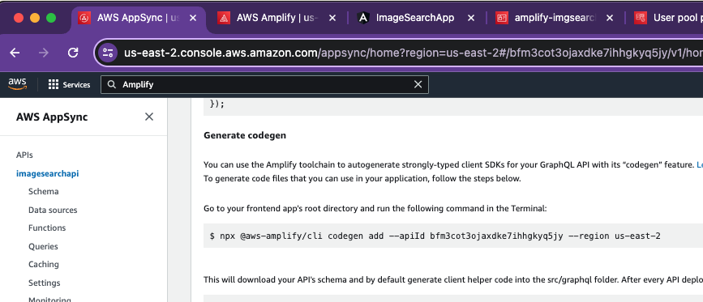
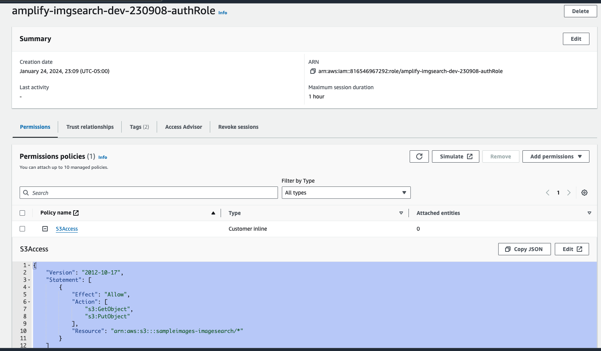

# Image Search Application 

## Introduction
The Image Search Application is an innovative solution designed to search through a MongoDB vector database using image content. It leverages AWS technologies and the  CLIP model deployed on Sagemaker to offer a seamless and efficient image searching experience.

### Technologies Used
- AWS Amplify
- AWS Sagemaker
- CLIP Model
- MongoDB
- Angular
- AWS Lambda
- AWS S3
- AWS AppSync

## Prerequisites
### 1. AWS Account
- An active AWS account is required to use AWS Amplify and other AWS services.

### 2. Node.js
- AWS Amplify requires Node.js for server-side logic. [Download Node.js](https://nodejs.org/).

### 3. NPM (Node Package Manager)
- NPM is used to install packages and comes included with Node.js.

### 4. Angular CLI
- This command-line interface tool is used to develop Angular applications. 


### 5. AWS Amplify CLI
- The AWS Amplify CLI is a unified toolchain for creating and managing AWS cloud services for your app.    
- Follow this [document](https://docs.amplify.aws/angular/start/getting-started/installation/) for setup

### 6. Set up environment variables in environment.prod.ts

```
export const environment = {
    production: true,
    s3Bucket: 'xxx',
    s3Folder: 'xxx',
    s3Region: 'xx',
    staticImagePath :'xxx'
  };
  
```

### 7. AppSync Api
- Create API as discused in previous tutorials


## Application Overview

- The application features an Angular-based Amplify UI.
- It includes a drag-and-drop interface for image upload. Uploaded images are stored in an AWS S3 bucket.
- The UI allows users to select a category for their image, which is stored as metadata in S3.
- Upon image upload, a GraphQL call is made using AWS AppSync, triggering a Lambda function.
- The Lambda function reads the image and metadata from S3, generates an embedding using the CLIP model, and performs a vector search in MongoDB.
- Search results are filtered based on the selected category and displayed in the UI.

## Setup Instructions


#### Clone the Repository
```
cd image-search-app/AmplifyUI/
```

#### Install Dependencies
```
npm install
```

#### Install aws-amplify
```
npm install aws-amplify
```

### Add the below highlighted line in main.ts
```
import amplifyconfig from './amplifyconfiguration.json';
```

### Add the below line in tsconfig.json

```
{
  ...
  "compilerOptions": {
    "allowSyntheticDefaultImports": true,
    "resolveJsonModule": true,
    ...
  }
}
```

### Add api

- Add the API we created like below


### Push the application

```
amplify push
```


### Add Auth

```
amplify add auth
```

### Push the application

```
amplify push
```

### Start the application

```
npm start
```

### Add the S3 Access role to the application Auth role




### Deploy and host app

```
amplify add hosting
amplify publish
```


#### Reference Link
https://docs.amplify.aws/angular/start/getting-started/installation/


## Usage
To use the app:
1. Navigate to the UI.
2. Drag and drop an image into the upload area or select an image from your device.
3. Choose a category for the image.
4. View the search results displayed based on the image content.


